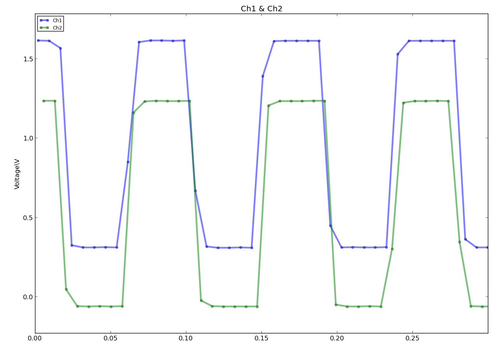
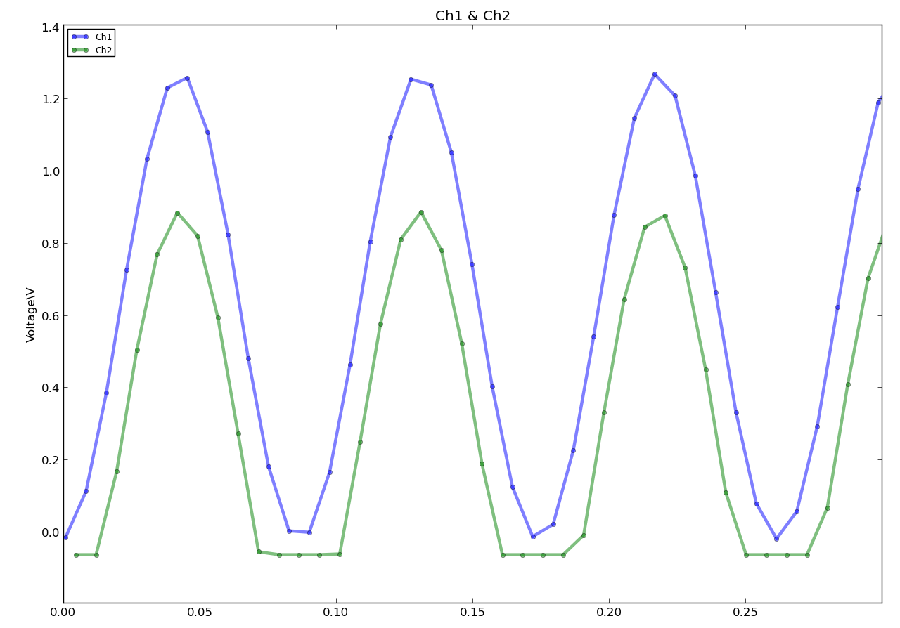
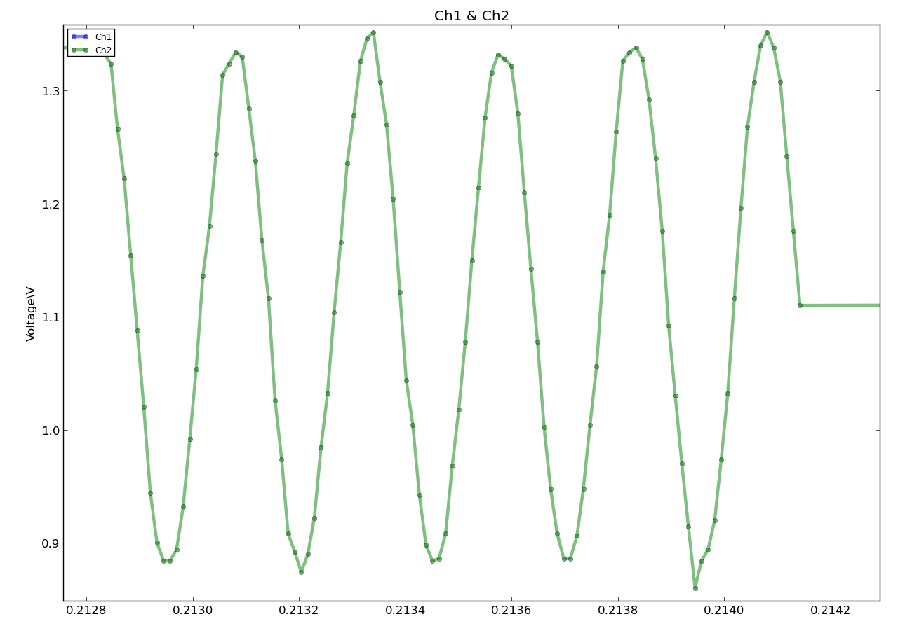
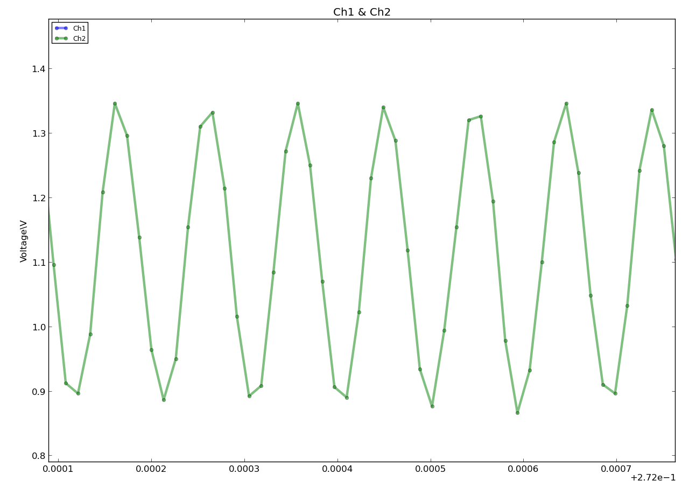

MSP430_Launchpad-Oscilloscope
==================
入门msp430写的一个小程序, 用msp430g2553@MSP430G2 Launchpad作一个简易示波器.

程序没有使用libmsp430-macrobull

MSP430 系列的 ADC10 转换速率最高可超过 200kSa/s, 实测在最快参数下能达到 300kSa/s, 但考虑到串口波特率使用115200, 并为了方便调试与检验使用了可阅读字符发送, 每个 10bit采样占用 4 字节, 发送速率每秒仅 2.88k 组, 加长了采样保持时间, 避免了不必要的浪费, 减小误差,实际上程序实现中每通道速率约为 80kSa/s.

简易示波器以A5(P1.5)和A4(P1.4)分别作为Ch1, Ch2采样电压, 参考电压2.5V, 采样保持时间64ADC周期.

MSP430的连续多通道采样模式是轮循各通道的, 即从A5至A0, 用在这里不大方便(A1, A2占用, 不能改成A0, A1,引起浪费与增大噪声). 所以先对A5连续采样再对A4连续采样. 由于10bit数据最大值1023, 为了使输出更紧凑易读, 加入零点设置, 使结果变为-32 ∼ 991, 就可设置输出格式为4位每个采样, 如: A345A367 表示两个通道一的数据 345与367. 一组数据由XS开始,由XE结束, 其中X=A,B, 表示通道1或2.

由于异步串口通信时间不准确性, 发送的数据中应当加入时间戳, 考虑到16位计数器周期32768, 使用内部较准确的时钟VLO记录时间戳, 在采样开始和结束时记录16位绝对值, 每个采样点的时间由这两个值均分, 经测量, 均分时间误差低于3% 16位时间戳与实际时间的同步在电脑上进行.

采样的数据可以根据电脑发送的值调节中值滤波的结果, 低速模式可以计算110个采样点的平均值, 高速模式可以将原始采样值直接呈现. 为了直观发送控制信息, 控制值是ascii字符, 因此在接收时有一个数值累计过程, 以收到一个非数字字符结束并应用控制值.

为保证程序稳定性, 程序中启用了看门狗, ”喂狗”语句”weego”在misc.h中定义.

效果
------

低速模式12Hz方波测量: 

低速模式12Hz正弦波测量: 

高速模式3.6kHz正弦波测量: 

高速模式10kHz正弦波测量: 

